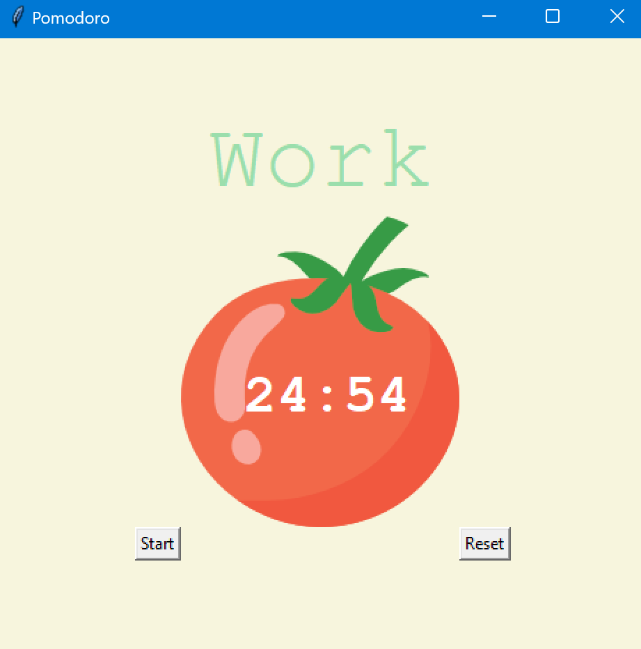

# Pomodoro technic clock

## part of 100days of code Bootcamp

### created with tkinter module

## To use it:
    - you need to have python 3 installed on your machine
    - download the repository
    - open terminal in the pomodoro folder and run
      `python main.py`
    - Start button starts the timer according to pomodoro rules (25 minutes work, 5 minutes break, after 4 working sessions longer break of 20 minutes)

